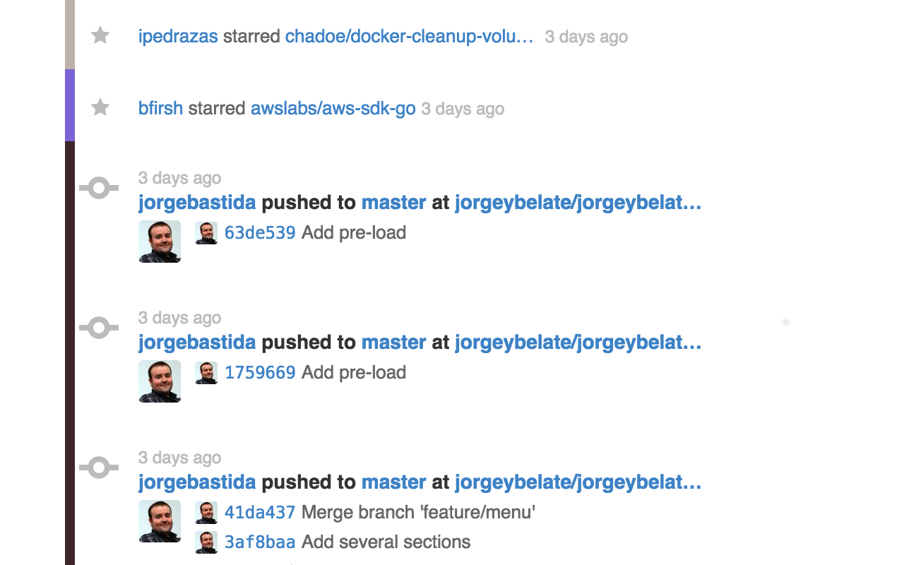

github-colorify
===============

github-colorify is an extension for:

- [x] Chrome
- [ ] Firefox

that will add colors to the rows on your github timeline. This will allow you
to easily differentiate between projects because they will be grouped with the
same background color.

Installation
------------

This project is in really early stages. If you want to install it you will need
to:

1. go to [chrome://extensions](chrome://extensions)
2. activate the developer mode.
3. Click on "Load unpacked extension" and select the path were you have
   downloaded this extension.

TODO
----

- Improve the CSS applied a little bit.
- Allow configuration for the "seen" projects background color.
- Allow configuration for the list of colors.
- Improve color load for projects when clicking on 'more' button.

Acknowledges
------------

I got the app icon from here:
http://png-1.findicons.com/files/icons/2808/jolly_icons_free/128/github.png

I couldn't find any license attached to it, hope that it's free, but if you
know the author let me know!
